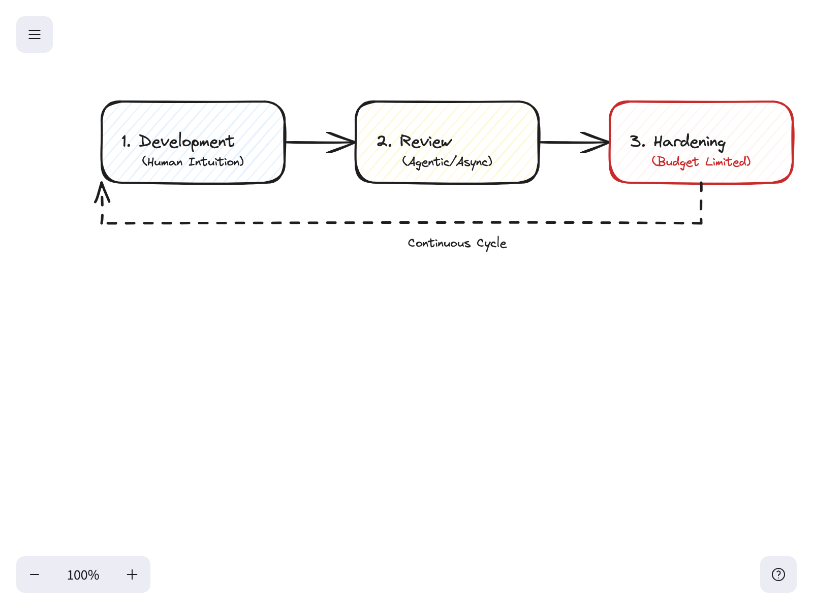
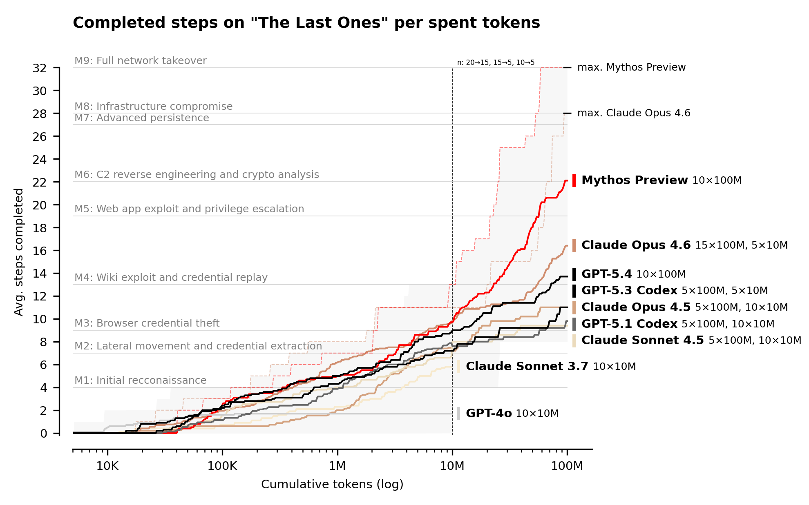

上周，*Anthropic* 披露了其名为 *Mythos* 的新一代大语言模型，其在计算机安全任务上的表现被形容为“惊人地强大”，以至于官方出于安全考虑未向公众开放，仅向关键软件制造商授权以供系统加固。随着 **AI Security Institute** (*AISI*) 发布的首份第三方分析报告落地，这场关于 AI 安全能力的讨论正式从“震撼与怀疑”转向了深刻的经济逻辑重构。

### 从“机巧”转向“工作量证明”

*AISI* 的报告详述了不同模型在模拟复杂企业网络攻击（**The Last Ones**）中的表现。这是一项包含 32 个步骤、涵盖从初始侦察到全面接管的模拟任务，通常需要人类专家 20 小时的连续工作。在测试中，*Mythos* 是唯一完成该任务的模型，在 10 次尝试中成功了 3 次。

这一结果揭示了一个冷酷的安全经济学：**硬化一个系统，本质上需要投入比攻击者更多的代币来发现漏洞。**

在测试中，*AISI* 为每次尝试分配了 **100M tokens** 的预算。这意味着单次 *Mythos* 尝试的成本约为 12,500 美元。令人担忧的是，即便在如此庞大的预算下，模型依然没有表现出边际收益递减的迹象。这意味着安全不再仅仅是代码层面的博弈，而演变成了一种类似于加密货币的**工作量证明（Proof of Work）**机制——成功的概率直接取决于投入的原始计算量。

### 开源软件的“林纳斯定律”与代币溢价

如果安全纯粹是代币投入的规模战，那么开源软件的地位将变得更加微妙。长期以来，开源界信奉**林纳斯定律（Linus’s Law）**，即“只要有足够的眼睛，所有漏洞都是浅显的”。在 AI 时代，这一定律可以扩展为：**只要有足够的代币，所有漏洞都是可挖掘的。**

对于那些依赖开源库的企业来说，如果他们愿意投入预算用代币进行“代币化加固”，其安全性可能会超过任何独立封闭系统的预算上限。然而，这也意味着攻击者攻击高价值开源目标的动力也被同步放大。在这种环境下，*Andre Karpathy* 此前提出的“通过 LLM 剥离依赖项以减少供应链风险”的策略可能需要重新评估——如果安全性不再来自代码的简洁，而是来自代币的冗余投入，那么维护昂贵的防御成本将成为常态。

### AI 原生开发的第三阶段：加固期

随着这一趋势的明确，Agentic Coding（代理化编程）的开发流程正在从传统的两阶段向三阶段演进：

1. **开发阶段（Development）**：实现功能，由人类直觉和用户反馈引导，快速迭代。
2. **评审阶段（Review）**：文档编写、重构及代码优化，应用最佳实践。
3. **加固阶段（Hardening）**：这是最关键的转变。在预算耗尽前，由 AI 代理自主识别并修复漏洞。

在这个新范式中，人类输入是第一阶段的限制因素，而**金钱**则是最后一个阶段的瓶颈。以前，安全审计是稀缺且不连续的；现在，安全成为了一个持续的支出项，一种可以通过预算控制的工程变量。

代码本身依然是**廉价**的，除非它被要求是**安全**的。除非模型在安全回报上达到饱和点，否则防御者始终面临着一个简单的算力博弈：你必须买到比攻击者更多的代币，才能在概率论的博弈中占据上风。
