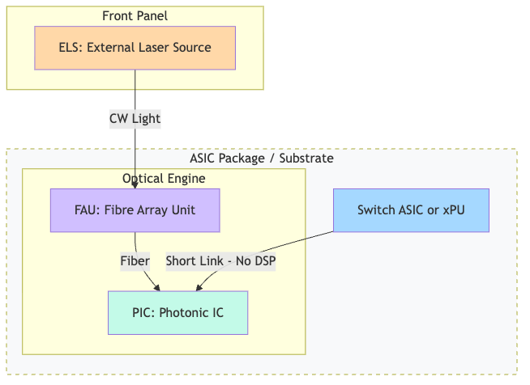

随着 AI 基础设施（[[ai-infrastructure]]）的快速扩张，数据中心对带宽和功耗的要求达到了前所未有的高度。传统的插拔式光模块正逐渐触及物理极限，而 **CPO (Co-Packaged Optics，共封装光学)** 正在成为行业公认的破局点。

## 什么是 CPO？

CPO 是一种先进封装技术，它将基于硅光（[[silicon-photonics]]）的“光引擎”直接集成在交换机 ASIC 或 AI 加速器（xPU）的基板上。通过缩短电信号的传输距离（从几十厘米缩短到几毫米），CPO 彻底消除了对 PCB 铜线的依赖。

## 为何 CPO 是 AI 时代的必选项？

根据 Wiki 知识库的深度分析，CPO 相比传统架构具有以下压倒性优势：

1. **革命性的功耗节省**：
   - CPO 移除了功耗大户——DSP 重定时器（占据光模块总功耗的 25-30%）。
   - 以 800G 为例，传统插拔模块功耗约为 **15-16W**，而 CPO 方案仅需 **5W**。
   - 整体节能效果最高可达 **70%**。

2. **解决面板带宽密度瓶颈**：
   - 随着交换机向 51.2T 和 102.4T 演进，前面板空间已无法容纳更多插拔模块。CPO 通过内部集成，极大提升了带宽密度。

3. **外部激光源 (ELS) 的灵活性**：
   - 采用 **ELS (External Laser Source)** 设计，将易损的激光器放在前面板，既解决了散热难题，又实现了“坏了就换”，提高了系统的可靠性。

## 行业时间线与市场趋势

- **2025-2026年**：1.6T CPO 开始试运行（如 Broadcom TH5 Bailly 和 Nvidia Quantum-X）。
- **2027-2028年**：随着 3.2T 端口的需求出现，CPO 将迎来真正的商业化拐点（Inflection Point）。
- **2030年展望**：UBS 预测 CPO 在光收发器市场中的占比将达到 **20%-25%**。

## 产业链关键玩家

- **核心芯片/方案**：[[broadcom]]、[[nvidia]]、[[marvell]]。
- **制造与封装**：[[tsmc]]（COUPE 平台）、[[ase]]、[[besi]]（混合键合）。
- **光组件供应商**：[[foci]]（FAU 关键供应商）、[[lumentum]] 与 [[coherent]]（CW 激光源）。
- **载板**：[[ibiden]]（由于布线复杂，CPO 载板价值量有望翻倍）。

## 总结

CPO 不仅仅是一项封装技术的升级，它是对数据中心互联架构的一次重构。随着 1.6T 时代的临近，从“插拔”转向“共封装”已是大势所趋。

---
*本文基于 [[co-packaged-optics]]、[[silicon-photonics]] 及 [[external-laser-source]] 等知识库内容编写。*
