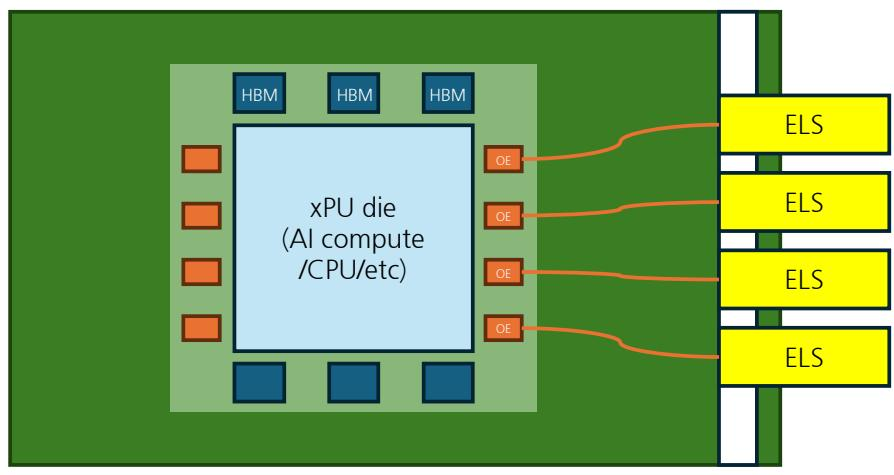
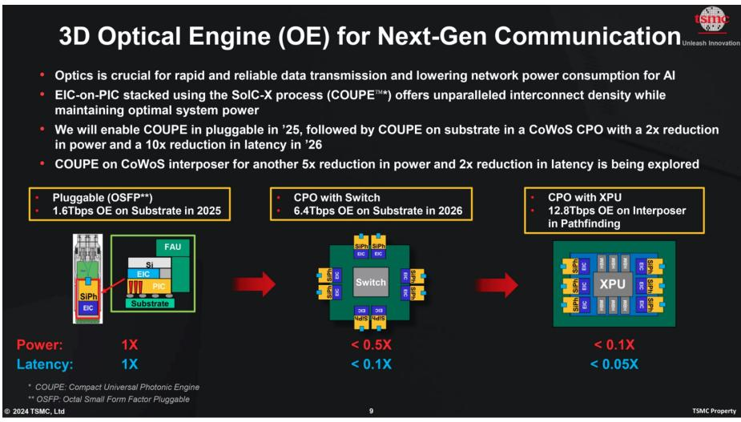

在 AI 算力竞赛的牌局中，如果说过去两年大家的目光都盯着 *Nvidia* 的 GPU 产能，那么未来的焦点正在悄然向“互联”转移。当数以万计的 GPU 被塞进同一个数据中心集群，如何让这些“大脑”之间实现无缝沟通，成了决定算力效率的生死线。

这里涉及两个核心维度：**Scale-out（横向扩展）** 和 **Scale-up（纵向扩展）**。前者是机柜间的连接，早已是光模块（Pluggable Optics）的天下；而后者，即服务器内部或机柜内的 GPU 互联，长期以来一直由“铜线（Copper）”统治。然而，随着 *UBS* 亚洲半导体分析师 *Sunny Lin* 在最新报告中所指出的，铜线的物理极限正在逼近，AI 集群的 Scale-up 正在迎来一个历史性的技术拐点。

### 铜线的黄昏与光的进场

在 800G 甚至 1.6T 的时代，铜线的传输距离被压缩到了极致。通常在短于 2 米的距离内，铜线凭借其成熟度和成本优势依然是首选。但当集群规模从 72 颗 GPU 进一步向百颗、千颗跨越时，传统的 NVLink 铜缆方案在功耗和信号完整性上开始显得力不从心。

正是这种背景下，**共封装光学（CPO）** 被推到了聚光灯下。与传统的插拔式光模块不同，CPO 将光引擎（Optical Engine）直接与 ASIC 或 xPU 封装在一起。这种“紧贴”的设计，将电信号转化为光信号的路径缩短到了毫米级。

正如 *Broadcom* 展示的 *TH5 Bailly* 方案，通过这种高度集成，系统能耗最高可降低 70%。这不仅仅是省电的问题，在散热空间极度有限的 AI 机柜里，每一瓦功耗的节省都意味着能塞进更多的算力单元。

### 为什么 Scale-up 是 CPO 的“真命天子”？

目前 CPO 的商业化落地优先选择了机柜间的 Scale-out 场景，但这更多是因为该场景对可靠性的容忍度更高，且易于更换。而真正的爆发点，藏在 Scale-up 的 xPU（加速器）端。

根据 *ASE*（日月光）的技术路线图，我们正处于从板载光学（On-board Optics）向真正 CPO 迈进的过渡期。xPU 的 CPO 集成虽然面临极其复杂的散热挑战，但其带来的带宽密度提升是不可替代的。*UBS* 预测，虽然 xPU 的 CPO 渗透可能在 2028-2030 年才会放量，但其潜在的规模将远超目前的交换机端。

对于投资者而言，这里的价值链位移尤为值得关注。传统的光模块市场相对碎片化，依赖 *Lumentum*、*Coherent* 等老牌厂商以及中际旭创等模块封装厂。但在 CPO 时代，半导体生态正反向吞噬光学市场。

### 价值链的重构：谁在吃肉？

在这场变革中，**晶圆代工厂（Foundry）** 成了新的制高点。*TSMC* 推出的 *COUPE*（紧凑型通用光引擎）平台，利用其先进的混合键合（Hybrid Bonding）技术，将光芯片（PIC）与电芯片（EIC）垂直堆叠。这种“芯片级”的集成，让台积电在算力代工之外，又筑起了一道光的护城河。

与此同时，**封装与测试（OSAT）** 环节的价值也在提升。*ASE/SPIL* 凭借在光纤阵列单元（FAU）耦合和 2.5D 封装上的深厚积累，正在成为 CPO 落地不可或缺的推手。而像 *FOCI*（上诠）这样的 FAU 连接器供应商，其 ReLFACon 技术因为能耐受高回流焊温度，已成为 *COUPE* 平台的重要组成部分。

值得注意的是，激光源的设计也在发生分化。由于硅本身不发光，激光源成了系统中最“脆弱”的部分。目前行业共识是采用**外部激光源（ELS）**。这种设计将发热量大且易损的激光器放在机箱面板上，像 U 盘一样可插拔，极大地解决了 CPO 系统的可维护性难题。

### 写在最后（不对，这是 AI 典型结尾，去掉）

在这个“算力即权力”的时代，我们正见证着互联技术的范式转移。从铜到光，从插拔到封装，这不仅仅是材料的更替，更是系统架构的重定义。对于关注中长期确定性的投资者来说，CPO 在 Scale-up 领域的下半场机会，或许才刚刚开始预热。

*(图 1：xPU 系统的 CPO 集成示意图。来源：UBS)*

*(图 2：台积电 COUPE 平台架构。来源：TSMC)*
