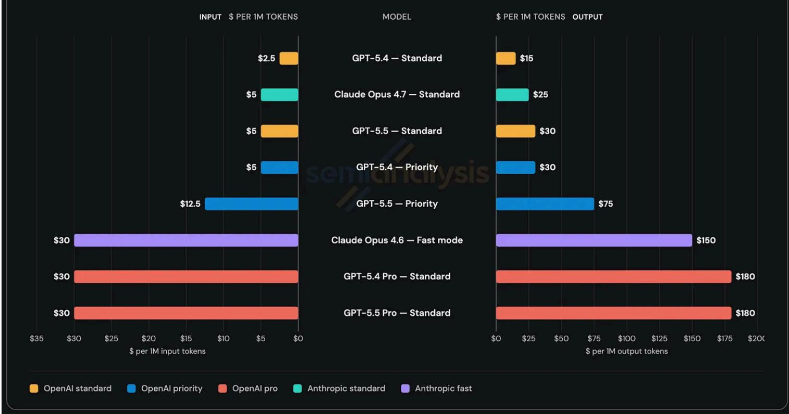
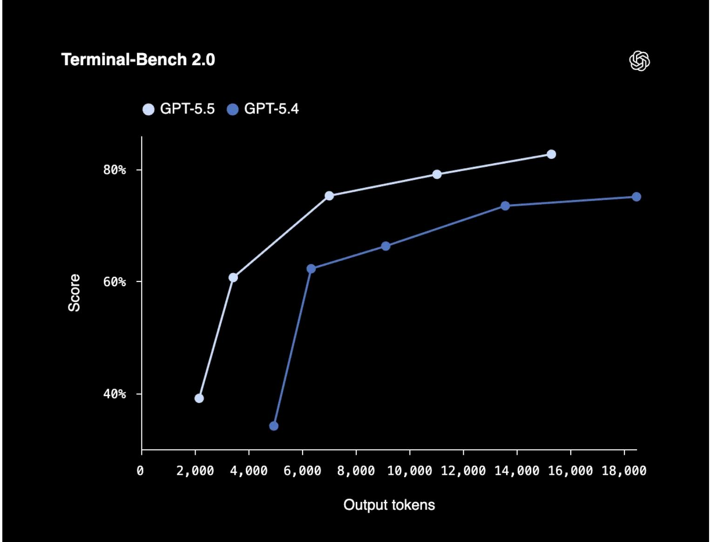
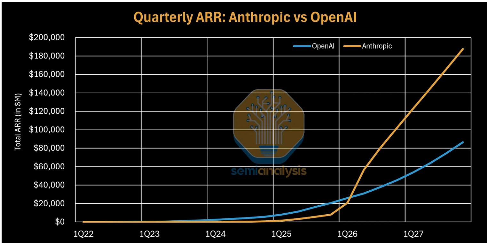

自 2026 年初 *Anthropic* 发布 *Claude Code* 以来，编程智能体（Agentic Coding）的市场格局正以周为单位发生剧变。过去三个月里，从 *Google* 的 *Gemini 3.1 Pro* 到 *Meta* 的 *Muse Spark*，各大实验室几乎都在密集输出针对编程任务优化的 Checkpoint。然而，真正决定胜负的转折点发生在最近几天：*OpenAI* 带着代号为 “Spud” 的 **GPT-5.5** 重回王座，而 *Anthropic* 则通过 **Opus 4.7** 开启了极具争议的“依云水（Evian Water）”溢价策略。

### 告别“Token 经济学”：效率才是真金白银

长期以来，开发者和投资者习惯于通过每百万 Token 的价格来衡量模型成本。但随着推理架构的演进，这种线性逻辑正在失效。正如 *SemiAnalysis* 的 *Dylan Patel* 在最新分析中所指出的，**任务效率（Token Efficiency）** 才是决定模型商业价值的“北极星”指标。

虽然一些模型单看 Token 价格更贵，但如果它能用更少的推理步数解决同一个复杂的 Bug，其“单次任务成本（Cost per Task）”反而更低。以最新发布的 **GPT-5.5** 为例，尽管其 API 价格较前代翻倍，但在实际的编程 Trace 中，它通过更精准的上下文调取减少了冗余输入，使得在处理长程任务时的总开销并未同步飙升。

| 模型 | 输入价格 (per 1M) | 输出价格 (per 1M) | 核心特性 |
| :--- | :--- | :--- | :--- |
| **GPT-5.5 (Spud)** | $5 | $30 | 极致推理效率，SOTA 级长程任务处理 |
| **Opus 4.7** | $15 | $75 | 引入 xhigh 推理级别，支持高分辨率截图 |
| **DeepSeek V4 Pro** | 开源 / 极低成本 | 开源 / 极低成本 | 1M 上下文，KV Cache 减少 90% |

*图：GPT-5.5 与 Claude 系列 API 价格对比（来源：SemiAnalysis）*

### OpenAI 的回归与 Anthropic 的“依云水”困局

在经历了长达半年的“非世界级”低谷后，*OpenAI* 凭借 **GPT-5.5** 终于回到了技术曲线的最前沿。这款模型不再仅仅是简单的参数扩张，其核心优势在于对开发者真实意图的理解——它在 *Codex* 环境下表现出的那种“在改动代码前反复咀嚼上下文”的审慎态度，让许多一度转投 *Claude* 阵营的工程师开始回归。

相比之下，*Anthropic* 似乎正深陷于其 AGI 理想主义带来的算力瓶颈。为了应对疯狂增长的推理请求，*Anthropic* 在 **Opus 4.7** 的定价上采取了极其激进的策略，甚至通过移除“Fast Mode”和变相增加 Token 计数（由于新的 Tokenizer 更加细颗粒化）来变相涨价。这种策略被业内戏称为“依云水”化——只服务于支付能力最强的金字塔尖，而将广大开发者推向了更加亲民的 *OpenAI* 或开源阵营。

*图：不同模型在处理相同任务时的 Token 消耗对比（来源：OpenAI）*

讽刺的是，就在 **Opus 4.7** 发布后的第三天，*Anthropic* 发布了一份沉重的复盘报告，承认在过去几周里，由于推理层级的下调和系统 Prompt 的失误，*Claude Code* 确实存在性能下降的问题。当“脚手架”本身成为产品的一部分时，任何底层的微小 Bug 都会被用户直接归咎于模型智能的退化。

### DeepSeek V4：开源界的 KV Cache 革命

如果说闭源双巨头在博弈品牌溢价，那么 *DeepSeek* 则在挑战物理极限。新发布的 **DeepSeek V4** 引入了 **Compressed Sparse Attention (CSA)** 和 **Manifold-Constrained Hyper-Connections (mHC)**，在 1M 上下文的极端场景下，将 KV Cache 的占用降低了惊人的 90%。

这意味着，曾经只有顶级云厂商才能跑起来的超长上下文推理，现在正在变得平民化。尽管 **DeepSeek V4 Pro** 在处理极其复杂的逻辑推理（如高难度数学证明或中文文学创作）时仍略逊于 **Opus 4.7**，但它在工程上的极致优化已经足以让所有 NAND Flash 投资者感到背脊发凉。

| DeepSeek V4 版本 | 总参数量 | 激活参数量 | 上下文长度 | 核心创新 |
| :--- | :--- | :--- | :--- | :--- |
| **Flash** | 284B | 13B | 1M | 混合 FP4/FP8 精度，高性能推理 |
| **Pro** | 1.6T | 49B | 1M | 极低 KV Cache 占用，支持华为昇腾 NPU |

### 谁将赢得 Coding Agent 之战？

目前的市场依然是 *OpenAI* 与 *Anthropic* 的双雄会。尽管 *DeepSeek* 在开源社区大放异彩，但闭源模型的“软硬一体化”（即模型与 Harness 的深度解耦与协同）依然构成了极高的竞争壁垒。

*图：主流 Coding Agent 厂商 ARR 走势（来源：SemiAnalysis）*

有趣的是，*Anthropic* 在 ARR（年度经常性收入）上似乎已经实现了对 *OpenAI* 的反超，这主要归功于其高达 70% 的 API 收入占比，这部分收入随业务规模线性增长。而 *OpenAI* 则由于其慷慨的免费层级和消费级属性，更像是一个“流量巨兽”。

随着 **GPT-5.5** 的大规模铺开，*OpenAI* 能否利用其巨大的分发渠道收复失地，取决于其能否在功能迭代（如插件生态、远程沙盒）上跟上 *Anthropic* 的节奏。在这场不仅拼智商、更拼财力和工程耐力的长跑中，我们正见证着编程这一人类古老技能被算法彻底重塑。
