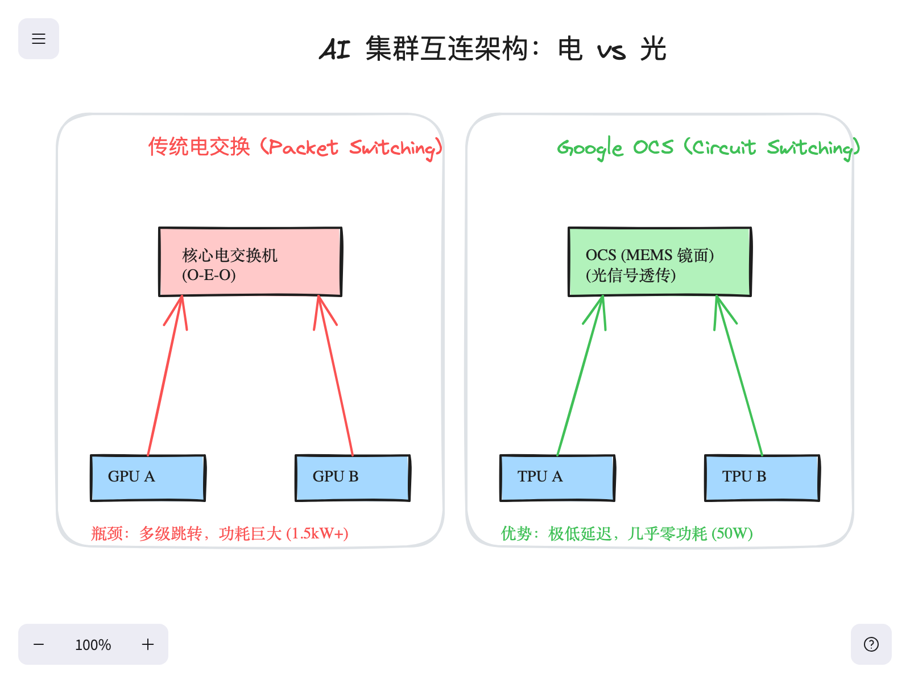
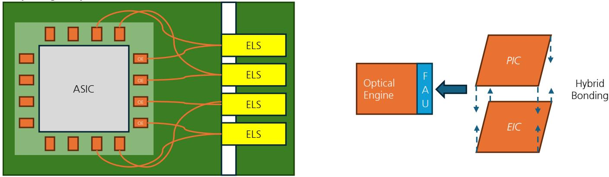
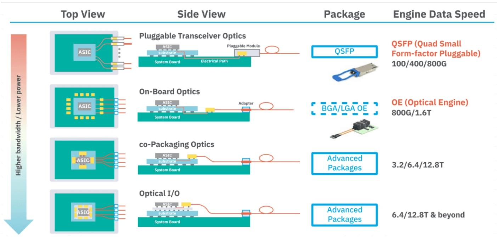
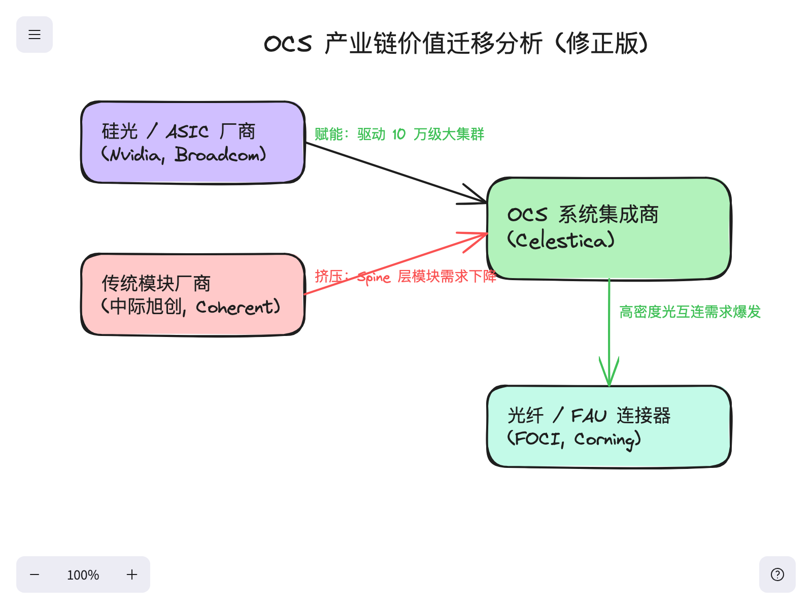
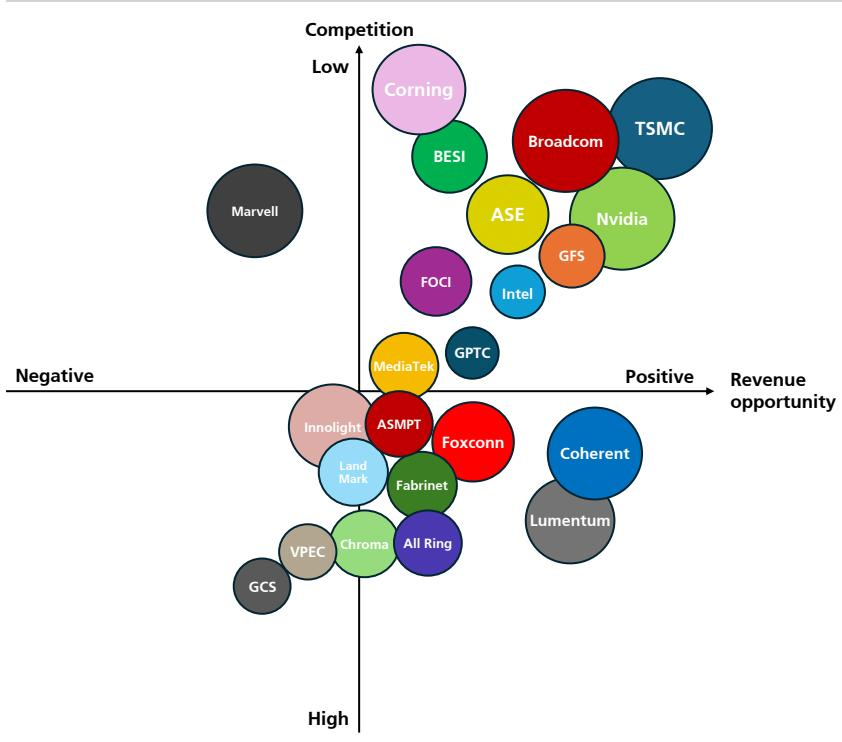

在训练万亿参数模型的军备竞赛中，人们往往将目光聚焦在算力本身——谁能抢到更多的 *Nvidia* H100 或 *Google* TPU。然而，一个更物理、更隐蔽的瓶颈已经悄然出现：**电力墙 (Power Wall)**。随着 AI 集群从 1.6 万张卡扩展到 10 万张甚至更多，仅仅在芯片之间搬运数据所消耗的能量，正面临超过计算本身功耗的风险。这种摩擦力正迫使 hyperscalers 重新思考数据中心的底层架构，从而引发了一场向 **OCS (光学电路交换)** 的关键转型。

### 越过晶体管：镜面的革命

要理解 **OCS** 的影响力，首先要看它剔除了什么。在传统的网络中，数据通过一系列“电交换机”传输。信号必须经历多次 **O-E-O 转换**（光-电-光）。光信号由 **光模块 (Transceiver)** 转换为电信号，由硅基 ASIC 处理，再转换回光信号。这个过程是现代网络发热和功耗的主要来源。

*Google* 通过引入 **OCS** 成功打破了这个循环。与传统交换机不同，**OCS** 本质上是一个“透明”的镜面箱体。它利用 **MEMS**（微机电系统）技术——数千个可以在毫秒内微调角度的微型镜面，将光束从一根光纤直接反射到另一根。由于不涉及任何电信号处理，**OCS** 的运行功耗接近于零，且几乎没有延迟。

这种转变也标志着网络从 **分组交换 (Packet Switching)** 向 **电路交换 (Circuit Switching)** 的回归，拓扑结构由光线物理“引导”。

### 光模块悖论：效率与规模的博弈

投资者对 **OCS** 的核心担忧在于其对光模块市场的影响。表面上看，**OCS** 似乎是模块厂商的利空。在传统架构中，交换机的每个端口都需要一个昂贵的光模块；而通过 **OCS**，hyperscaler 可以从网络的中间层剔除数以万计的模块。然而，这种效率恰恰是解锁“暴力扩展”的钥匙，从而触发了经济学中的 **杰文斯悖论 (Jevons Paradox)**。

当网络架构变得极其高效且节能，对网络资源的总需求反而会爆发式增长。通过移除 Spine 层的电力和散热限制，**OCS** 让 *Google* 和 *Meta* 能够构建比传统电交换设计大一个数量级的集群。虽然单条链路的模块数量减少了，但 10 万卡级别“超级集群”的总链路数导致光模块的总需求不降反升。

### 价值迁移：寻找供应链的真正赢家

**OCS** 的普及正在将 AI 供应链的利润池从传统的商品化交换硬件转向专业的系统集成和先进的物理层组件。

*Celestica* 已经成为了这一趋势的直接受益者，作为 *Google* 和 *Meta* 部署的 **OCS** 交换机的主要制造和集成伙伴。其护城河已从简单的硬件代工延伸至复杂的光学对准和高精度测试。

物理层同样经历了价值量的爆发。由于 **OCS** 需要在单个点上实现极高密度的光纤连接，对 **FAU** (纤维阵列单元) 和高层数 **ABF 载板** 的需求激增。在载板端，*Ibiden* 和 *南电 (Nanya PCB)* 也受益于 **CPO** 和 **OCS** 带来的层数跳升（从 16 层跳至 24 层以上）。

### 架构演变的关键指标对比

| 网络指标 | 传统电交换 Spine | OCS 光交换 Spine |
| :--- | :--- | :--- |
| **单条 GPU 链路模块数** | 4-6 个光模块 | 2 个光模块 |
| **单台交换机功耗 (51.2T)** | 约 1.5kW - 2.5kW | < 50W (仅镜面偏转) |
| **网络延迟** | 微秒级 (涉及缓存/处理) | 纳秒级 (光速传输) |
| **集群扩展上限 (电力受限)** | 约 3.2 万卡 | 10 万卡以上 |
| **网络拓扑结构** | 静态固定 | 动态可重构 |

更深层的影响在于“流体网络”的实现。在传统设定中，网络是僵化的；如果某种训练任务需要特定的流量模式，网络无法适应。而 **OCS** 允许 hyperscalers 实时调整镜面角度以适配模型架构（如 **Mixture-of-Experts, MoE**）。这种可重构性正成为顶级云厂商的核心护城河，换来的是更高的 GPU 利用率和更短的训练周期。
