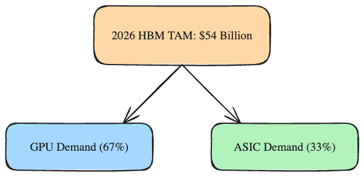

在这个由算力主导的时代，所有人的目光都紧盯着GPU。但如果你深入芯片供应链的深水区，你会发现另一个正在酝酿超级风暴的市场：**存储（Memory）**。

今天，我想聊一个反直觉的真相：**限制我们步入AGI时代的，或许不是算力，而是内存带宽与容量。** 并且，这不仅是技术瓶颈，更是商业上的“深水炸弹”。

我们整理了最新的全球存储供需数据，结合高盛等机构对2026年的前瞻预测，得出了一份清晰但令人震惊的图景：**2026年，我们将迎来过去15年来最严重的DRAM缺货，以及史上最大的NAND短缺。**

这不仅仅是周期性的反弹，这是一场由AI基础设施狂飙所引发的结构性供需失衡。

### 结构性短缺：数字背后的残酷真相

如果你在关注服务器和AI硬件产业链，你可能已经感受到了价格的温度。但整体画面的严峻程度依然超出了很多人的预期：

1. **DRAM（动态随机存取存储器）：** 2026年的供需缺口将达到惊人的 **4.9%**（2027年为2.5%）。服务器应用（如DDR、LPDDR、HBM、SOCAMM）的无止境需求，直接抽干了本就不充裕的产能。
2. **NAND Flash（闪存）：** 2026年供需缺口约为 **4.2%**。驱动力主要来自企业级SSD。AI不仅需要算，更需要存，海量多模态数据的预处理和调用让企业级SSD的消耗量呈指数级上升。

而供应商端，资本开支（CAPEX）和产能的扩张却相对保守，这种“克制”直接导致了我们即将面临的“15年一遇”大缺货。

### HBM：吞噬产能的“吞金兽”

在这场存储盛宴中，最耀眼的明星莫过于高带宽内存（HBM）。没有HBM，再强的GPU也只能“饿死”。

我们对2026年HBM的整体市场规模（TAM）预期已上调至 **540亿美元**，并在2027年直奔 **750亿美元**。

这里面有一个极其重要的信号：**ASIC（专用集成电路）对HBM的吞噬力正在急剧增强。** 
随着科技巨头们（如Google的TPU，AWS的Trainium等）加速自研硅片，ASIC在HBM总需求中的占比预计在2026年将达到 **33%**。这意味着，英伟达的GPU不再是HBM的唯一超级买家，买方之间的抢单竞争将比以往更加惨烈。

### 蝴蝶效应：消费电子的“不可承受之重”

当数据中心像黑洞一样吸走绝大部分的高端存储产能时，谁会成为受害者？

**答案是PC和智能手机。**

高昂的BOM（物料清单）成本将被迫转嫁。我们可以预见两种直接后果：
1. **需求抑制：** 终端设备涨价导致消费者换机周期进一步拉长。
2. **降配妥协：** 厂商为了保住利润率，可能会在下一代设备中抑制DRAM容量的升级幅度（比如原本标配16GB的机型可能退回12GB或放缓普及速度）。

但即便消费电子端出现“需求破坏（Demand Destruction）”，对于整体存储市场而言也无济于事。因为AI基础设施那边的缺口实在太大了，完全足以消化掉消费端的疲软。整个DRAM市场将保持高度紧绷。

### 给决策者的建议

如果你是硬件基础设施的采购方，锁定长单（LTA）并保障供应优先级是2026年的头等大事。如果你是投资者，三星（Samsung）、美光（Micron）等存储巨头正迎来他们利润率重回甚至突破历史高点的超级周期。

在这个时代，算力是引擎，而存储是油箱。油价正在飙升，并且，加不到油的风险比油价本身更致命。