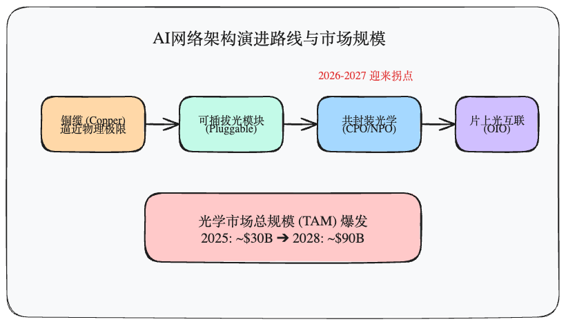
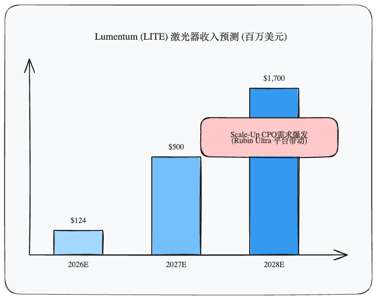

在探讨AI集群的算力瓶颈时，我们通常会将目光聚焦于GPU的迭代速度，或是HBM内存的容量与带宽。然而，当你深入最顶尖的超算数据中心，一个更加底层的物理极限正在悄然逼近——**铜缆与传统可插拔光模块的传输天花板。**

想要在2026年看懂AI基础设施的终局游戏，就必须理解正在发生的“光进铜退”革命，以及处于风暴中心的**共封装光学（CPO，Co-Packaged Optics）技术。**

根据我们梳理的大摩（Morgan Stanley）、花旗（Citi）等机构的最新硬核研究数据，**2026年将成为CPO技术的大规模商用拐点，这不仅将带来架构的彻底洗牌，更将引爆一个极具爆发力的新光学硬件市场。**

### 物理极限的倒逼：为什么要用 CPO？

目前主流的数据中心网络连接，要么使用的是极短距离的铜缆（Copper），要么是面板上的可插拔光模块（Pluggable Optics）。

随着AI集群的规模从千卡（Scale-out）向十万卡甚至更庞大的架构（Scale-up）演进，芯片间的I/O通信带宽呈指数级增长。传统的铜缆在高速率下信号衰减严重，传输距离被严重压缩，已经无法适应超大规模GPU集群的布线需求；而传统的可插拔光模块虽然解决了距离问题，但其高昂的功耗和相对庞大的体积，已经成为交换机和GPU节点进一步提升密度的致命瓶颈。

**共封装光学（CPO）** 的逻辑非常简单而粗暴：既然长距离电信号传输损耗太大，那就把光电转换模块（光引擎）直接和交换芯片（ASIC/GPU）封装在同一个基板上。

这种架构转变带来的直接收益是颠覆性的：
1. **极致的功耗降低：** 将电信号在PCB板上的走线距离缩短到了毫米级，热效率和整体系统功耗大幅下降。
2. **带宽密度翻倍：** 极大地节约了设备前面板的物理空间，使单台核心交换机能够轻易突破百T级别的吞吐量（例如 115.2T 甚至更高）。

### 2026-2027：巨头入局，双线并行的TAM大爆发

根据摩根士丹利的基准测算，随着AI速度升级带来的新光学技术普及，**全球光学市场总规模（TAM）将从2025年的约300亿美元，激增至2028年的超过900亿美元。** CPO和相关的高速光学组件在这其中贡献了极大的增量。

在这个进程中，2026年和2027年是至关重要的节点。整个市场的发展呈现出“Scale-Out（横向扩展）”与“Scale-Up（纵向扩展）”双线并行的态势：

#### 1. Scale-Out（横向扩展网络）的交换机革命
英伟达（NVIDIA）在GTC 2025上明确了其 Scale-out 网络的 CPO 路线图。2026年下半年，业界将迎来全集成化的 **115.2T CPO 交换机**（包含 Quantum-X 和 Spectrum-X 系列）。
在此之前，早期的NPO（近封装光学）方案由于性价比不高，渗透率有限。但随着先进封装技术的成熟，2026年第二季度供应链将正式启动产能爬坡。预计到2027年，单是英伟达的 CPO 交换机出货量就将达到数万台规模。

#### 2. Scale-Up（纵向扩展网络）的潜在颠覆
比交换机更具想象空间的，是 GPU 集群内部的互联（Scale-up）。
在即将到来的 **Rubin Ultra 平台**（预计2027年后期起量）中，现有的铜缆 NVSwitch 互联因为物理距离和功耗的限制，极有可能全面转向 CPO/NPO 架构。
**这意味着，不仅是网络交换机，每一颗 GPU、每一个 NVSwitch 节点，都将挂载高价值的连续波（CW）激光器和光引擎。**

我们以核心光学器件供应商 Lumentum (LITE) 的收入预测为例，可以清晰地看到 Scale-up CPO 带来的惊人业绩弹性：

据行业分析预测，随着 Scale-up CPO 在 Rubin Ultra 等平台上的应用，Lumentum 的相关激光器收入将从2026年的1.24亿美元，飙升至2028年的17亿美元以上。其中，单颗 GPU 的互联光器件价值量可能达到数百美元。

### 投资与产业启示：CPO 并不是终点

对于身处这场技术浪潮中的投资者和产业人士而言，核心结论非常清晰：

1. **光模块护城河正在重构：** 
   CPO 时代，核心的价值正从单纯的模块组装，向上游的**硅光芯片（Silicon Photonics）设计能力、先进封装（Advanced Packaging）以及高功率外部激光源（External Laser Sources）** 转移。掌握这些核心壁垒的厂商将享受长期的结构性溢价。
2. **从“可插拔”到“共封装”的价值对冲：** 
   诚然，CPO的大规模起量会在一定程度上侵蚀传统可插拔光模块（Pluggable）在高端市场的份额。但由于AI算力规模的膨胀速度远超预期，整体光学蛋糕的变大（TAM激增至900亿）完全足以消化这种替代效应。
3. **通往 OIO 的必经之路：** 
   CPO 仅仅是光学集成的中场战事。它的终局是完全的**片上光互联（OIO, Optical I/O）**。但在 OIO 彻底成熟之前，CPO 是未来3-5年内解决 AI 算力“数据堵塞”唯一可行、且可量产的物理方案。

在算力即权力的时代，数据怎么“存”（HBM）和怎么“算”（GPU）固然重要，但数据如何高效、低功耗地“跑”（CPO/OIO），才是决定一个十万卡集群能否真正运转的终极生命线。

---
*声明：本文数据综合自 Morgan Stanley、Citi、GFHK 等多家机构研报，不构成投资建议。*