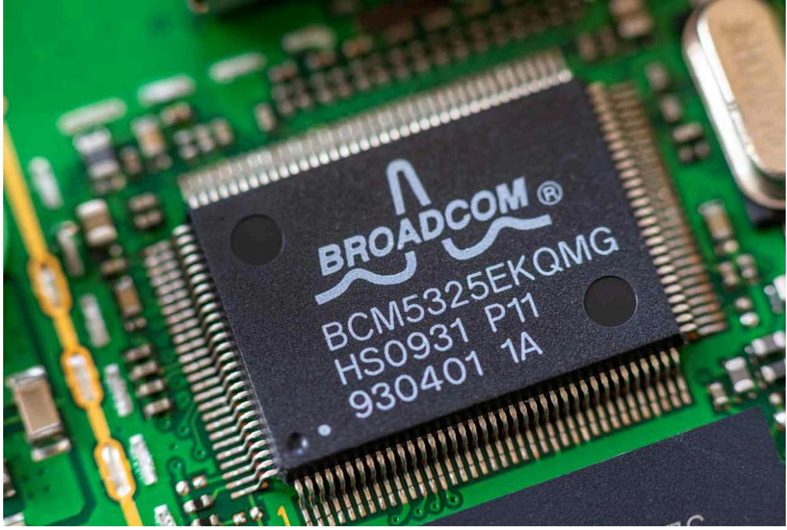

*亚马逊、谷歌、微软和Meta希望定制芯片能够减缓它们在AI方面的支出速度。芯片设计商博通和Marvell Technology由此应运而生。*

博通已成为仅次于英伟达的第二大AI芯片制造商。— Dreamstime By Adam Clark July 11, 2025

本月晚些时候的科技公司财报可能会揭示更多在人工智能方面的大规模支出。亚马逊、谷歌、Meta Platforms和微软仍然深陷于建设数据中心，以及购买英伟达芯片来填充这些中心的昂贵竞赛中。

有一种方法可以摆脱成本螺旋上升的困境：采购非英伟达制造的芯片。至少目前来看，没有哪家超大规模企业打算完全取代昂贵的英伟达芯片。但是，它们希望使用自己的芯片能够减缓支出速度。芯片设计商博通和Marvell Technology由此应运而生。

这两家公司都在开发一种名为专用集成电路（ASIC）的芯片。虽然这种处理器缺乏英伟达图形处理器（GPU）的全面能力，但它们可以针对可预测的大批量工作负载进行设计。而且，它们的平均成本仅为数千美元，而英伟达最新的GPU则超过30,000美元。

它们能占据多大的市场份额仍然存在争议。对于客户而言，切换到不同的芯片可能涉及**[令人沮丧的过渡](https://www.barrons.com/articles/nvidia-stock-price-2025-chips-outlook-8369e596)**，需要使用新的软件，这意味着ASIC通常仅限于内部工作负载。摩根士丹利分析师估计，2024年定制AI芯片的市场份额为11%，到2030年将升至15%。

这听起来可能并不令人印象深刻，但它是在不断增长的大蛋糕中占据更大的一块。Susquehanna的分析师表示，到2030年，AI加速器市场预计将从2024年的1240亿美元增长到3900亿美元。这意味着，虽然博通和Marvell可能不是英伟达的终结者，但它们提供了AI趋势中**[有价值的](https://www.barrons.com/articles/broadcom-stock-ai-nvidia-amd-93e0b5c6) [多元化](https://www.barrons.com/articles/broadcom-stock-ai-nvidia-amd-93e0b5c6)**选择。

定制芯片并不新鲜。Alphabet旗下的谷歌是相对资深的玩家，其张量处理单元（TPU）已经发展到第七代。

谷歌最新的定制芯片功能足够强大，可以媲美英伟达的硬件。它们正在配备更多的高带宽内存，这是执行AI应用程序背后计算的关键组件。

谷歌最新的TPU，名为Ironwood，拥有192 GB的高带宽内存，与英伟达最新的Blackwell芯片相当。根据Susquehanna的数据，以TFLOPS（芯片每秒可执行的万亿次浮点运算次数）衡量，Ironwood的表现始终名列前茅，与英伟达的Blackwell Ultra硬件并驾齐驱。

谷歌发言人告诉《巴伦周刊》：“TPU擅长深度学习和生成式AI应用程序的基础张量运算，而GPU仍然是传统机器学习以及涉及更广泛计算任务的高度通用选择。Ironwood在服务大型且复杂的生成式AI模型时表现出色。”

谷歌基本上每年都会推出一款**[新的TPU](https://www.barrons.com/articles/alphabet-stock-nvidia-ai-chips-83add66f)**，并且其Gemini AI模型的训练和服务100%依赖于自己的硬件。这对博通来说是个好消息，博通是谷歌芯片项目的主要合作伙伴。美国银行证券认为，谷歌的项目可能占博通AI计算销售额的80%以上。

博通现在已经牢固地确立了其作为仅次于英伟达的第二大AI芯片供应商的地位。这体现在其估值中，过去12个月其股价上涨了58%，最近的价格为275.50美元。根据FactSet的数据，其目前的远期市盈率约为35倍，高于英伟达的32倍。

尽管如此，Susquehanna分析师Christopher Rolland对博通给予了积极评级和300美元的目标价，他认为到2030年，博通将占据整个AI芯片市场约11%的份额，而英伟达将占据67%。

博通预计，到2027年，仅来自三个现有超大规模客户（通常被认为是谷歌、Meta和TikTok母公司字节跳动）的AI收入机会就将在600亿美元至900亿美元之间。博通表示，它总共与七个客户合作开发定制AI芯片。

Marvell是另一家主要的定制芯片厂商。Marvell在12月表示，它与亚马逊的云计算业务签署了一项为期五年的协议，其中包括提供定制AI产品，而微软高管也承认正在与该公司合作开发定制芯片。

Marvell仍然是AI芯片领域的次要参与者，其最近一个财年的数据中心收入为41.6亿美元，而英伟达为1152亿美元。然而，它正在迅速增长——Marvell当前财年第一季度的数据中心收入比去年同期增长了76%。

该股过去12个月下跌了3.9%，其远期市盈率为23倍，与英伟达和博通相比有很大折扣。

这表明投资者有机会，但首先Marvell必须说服华尔街，它能够赢得长期交易。

Marvell最近表示，它已经赢得了两个与未具名客户签订的新的AI芯片项目。华尔街分析师推测，这些公司可能是OpenAI或埃隆·马斯克的xAI。

“从根本上说，这归结为赢得跨越多代产品的合同。拥有大量差异化的IP[知识产权]至关重要，”William Blair分析师Sebastien Naji说。“你拥有的IP越多，你对整个芯片设计的贡献就越大，你就越能从这种关系中获利。”

Naji对Marvell股票给予了跑赢大盘的评级，认为风险回报比对其有利。Marvell最近将其定制AI芯片的总潜在市场规模从2028年的430亿美元上调至550亿美元。

英伟达仍然是AI芯片领域的王者，其年度改进速度使其难以匹敌。但是，亚马逊、谷歌、Meta和微软不习惯依赖单一供应商，单凭这一点就意味着定制AI芯片的市场将会不断增长。

