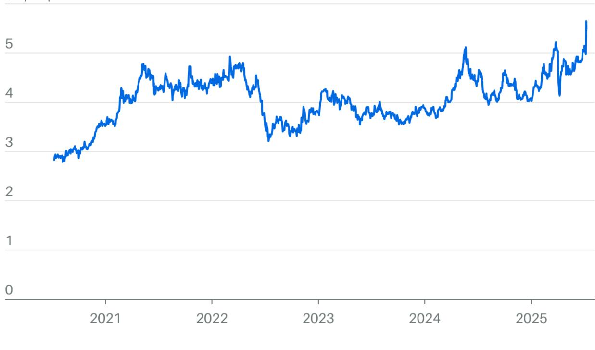

铜价一路飙升。即使特朗普总统掌握着进一步上涨——或者下跌（如果他放弃关税威胁）——的关键，投资者现在加入也为时不晚。

特朗普最新的举动——**[对铜进口征收 50% 的关税](https://www.barrons.com/articles/copper-mining-stocks-tariffs-trump-3d8dc5de)**——震惊了市场。自从商务部长霍华德·卢特尼克下令根据 232 条款对铜进口进行**[国家](https://www.barrons.com/news/us-to-probe-need-for-tariffs-on-copper-imports-16ca4946) [安全调查](https://www.barrons.com/news/us-to-probe-need-for-tariffs-on-copper-imports-16ca4946)**以来，华尔街的共识一直是征收 10%-25% 的关税。卢特尼克表示，50% 的关税将于 8 月 1 日生效。

高盛等投资银行和许多交易员都认为这种威胁是可信的。高盛分析师在一份最新报告中表示，他们认为 50% 的关税有 60% 的可能性会被纳入 2025 年 12 月的合约价格中。美国铜价约为每磅 5.60 美元，接近历史高位。今年以来价格上涨了近 40%，其中包括在 7 月 8 日特朗普发布关税威胁后上涨了 12%。

铜被称为“金属博士”，因为它被认为是全球经济和工业活动的主要指标。需求一直很健康，并且受到全球数据中心建设、车辆电气化和发电厂升级的推动，以满足人工智能、智能手机和其他技术日益增长的电力需求。

特朗普希望增加国内产量，但这需要数年时间才能实现，使得美国严重依赖进口。在过去几年中，美国消耗的铜近一半依赖进口，主要来自智利（占进口的 65%）和加拿大（占 17%）。秘鲁和墨西哥分别占另外的 9% 和 6%。

目前，由于公司试图抢在关税生效前囤积库存，出现了一波囤货潮，这扭曲了价格。美国铜价的交易价格比伦敦证券交易所的价格高出近 30%。金属投资公司 Sprott Asset Management 的交易所交易基金产品经理 Jacob White 指出，美国和伦敦的价格通常相差无几。如果特朗普放弃 50% 的关税，价格可能会跌回关税宣布前的水平。

Jefferies 分析师 Christopher LaFemina 表示，价格也可能因另一个原因下跌：购买了过剩库存的美国买家可能会在价格居高不下时退出市场。

对于交易员来说，等待回调可能是有益的。LaFemina 表示：“虽然短期内可能会出现价格下跌的真空期，但我们会在任何近期的疲软时买入我们首选的铜矿股。”

如果您不是大宗商品交易员，则有两种广泛的投资方式：直接通过 ETF 押注大宗商品，或者购买铜矿股或基金的股份。

获得大宗商品敞口的最直接方法是通过 ETF。United States Copper Index fund (代码：CPER) 是最大且唯一的纯铜 ETF，持有 9 月、12 月和 2026 年 3 月交割的期货合约，以及国库券和现金。该基金今年上涨了 38%，很大程度上与铜价走势一致。但它也有缺点：期货必须不断展期，增加了交易费用，并且该基金 1% 的费用率会拖累回报。

虽然没有其他铜 ETF，但有很多矿业基金。最大的是 SPDR S&P Metals & Mining ETF (XME) 和 iShares MSCI Global Metals & Mining Producers ETF (PICK)。两者都持有铜矿商的股份，以及生产其他金属的公司的股份。这些基金今年上涨了近 20%。

矿业公司的走势不会像铜 ETF 那样紧密地跟踪大宗商品，但它们的多元化提供了缓冲，以防铜价暴跌。并且它们还有其他的增长动力，并计划扩大矿山和精炼业务。

在大型股中，Freeport-McMoRan 可能是搭上美国关税列车的最佳选择。这家矿商是美国最大的铜生产商，在新墨西哥州和亚利桑那州拥有矿山。该公司 2024 年 74% 的收入来自铜销售，使其对铜的杠杆率在大盘矿商中最高。Freeport 还经营冶炼厂和精炼设施，占美国精炼铜产量的 70%。

Freeport 在全球范围内运营，并且该公司正在美国、智利和印度尼西亚扩张，目标是将铜产量从今年的 40 亿磅提高到 2027 年的 43 亿磅。Freeport 也是一家黄金矿商，并受益于金价的上涨。

RBC Capital Markets 分析师 Sam Crittenden 在一份报告中表示，Freeport“有独特的优势可以从美国更高的价格中受益”，他建议买入该股。德意志银行分析师 Liam Fitzpatrick 也持乐观态度，他在一份报告中表示，由于特朗普的关税，该公司“与全球铜业同行相比，显然是一个受益者”。

Freeport 的估值并不便宜，市盈率约为预期收益的 28 倍，略高于其五年平均水平。华尔街的平均目标价为 50 美元，意味着较近期 47 美元左右的价格有 6% 的上涨空间。

尽管如此，该股的交易价格比其 200 天移动平均线 41 美元高出 15%，表明它有一定的支撑，并可能继续上涨。

Crittenden 还喜欢在美国拥有项目的小公司，如果关税持续，这些公司将受益。他的两个首选股是 Hudbay Minerals 和 Arizona Sonoran Copper。两者都在亚利桑那州拥有采矿业务。Hudbay 是一家规模较大的公司，市值为 42 亿美元；Arizona Sonoran 是一家小型公司，市值为 4 亿美元。它在多伦多证券交易所交易。

这两只股票都被认为是“初级矿商”，这使得它们尤其具有风险。像 Sprott Junior Copper Miners ETF (COPJ) 这样的基金将数十家公司捆绑在一起，从而减轻了一些风险。Taseko Mines、Solaris Resources 和 NGEx Minerals 是其三大持股。该 ETF 今年上涨了 40%。

如果铜价暴跌，矿业股和 ETF 将面临压力。虽然 Freeport 的黄金业务提供了一些缓冲，并且持有其他矿业公司的 ETF 也有缓冲，但最终还是大宗商品驱动回报，并且工业金属（黄金除外）往往会同步波动。

特朗普的贸易官员与智利和加拿大等外国生产商之间可能会进行更多谈判。一旦出现达成协议的迹象，这些股票就会下跌。押注“特朗普总是在关税问题上退缩”——**[一项被称为](https://www.barrons.com/articles/taco-trump-trade-a2cf0bca)** **[TACO 的交易](https://www.barrons.com/articles/taco-trump-trade-a2cf0bca)**——一直是有利可图的。对于矿商来说，情况则恰恰相反。

鉴于未来可能出现的波动，按兵不动，等待铜热消退，然后搭上铜列车可能是有益的。

*由于特朗普的贸易战，该商品的价格接近历史新高。对投资者而言，在逐步介入之前，等待回调或许是明智之举。*
