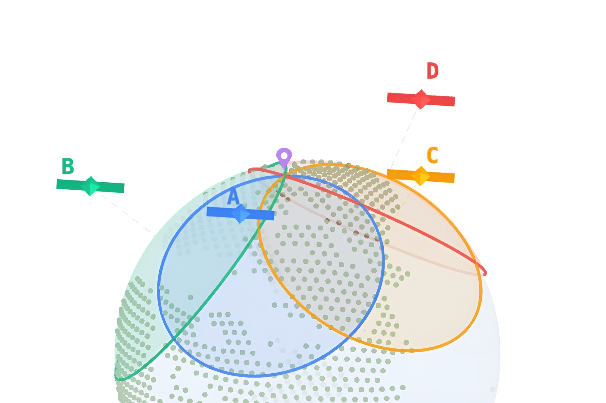
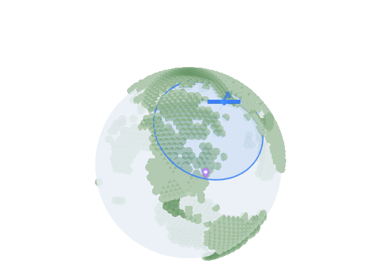
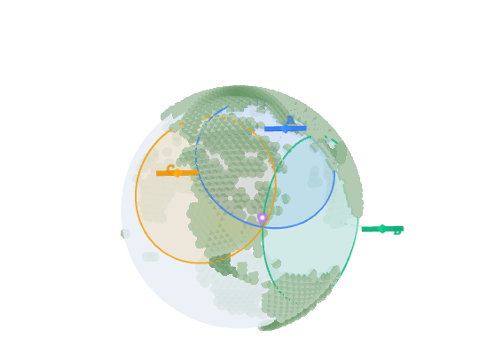
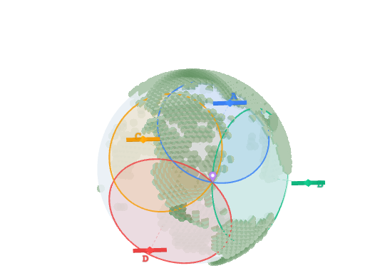

我们现在几乎完全依赖 *GPS*（全球定位系统）来探索世界。无论是在城市密林中寻找出口，还是在远郊荒野规划路线，手机屏幕上那个稳定的小蓝点总能给我们带来安全感。

但你是否曾经在信号重搜的焦虑瞬间停下来思考过：**这台巴掌大的设备，究竟是怎么在几万公里的太空中锁定你的位置的？**

答案在某种程度上出人意料地简单，但在深层逻辑上又极其复杂。*GPS* 本质上是一个**时间翻译工具**：它将“时间”转换成“距离”。

### 1. 尺子：将纳秒转化为米

每一项 *GPS* 测量都始于一个“秒表”。卫星以光速广播信号，你的手机接收信号并检查旅程耗时。

**1 纳秒的时间误差，就意味着 0.3 米距离偏差。** 

当卫星发送信号时，它会打上一个时间戳。手机收到信号后，通过计算“接收时间”与“发送时间”的差值，再乘以光速，就能得到你与卫星之间的精确距离。这就是 *GPS* 的基本构建模块。

### 2. 三球定点：几何学的魔术

如果只知道你距离一颗卫星 *A* 是 20,000 公里，那么你可能处于以这颗卫星为球心、半径为 20,000 公里的**球面**上的任何一点。

*   **一颗卫星：** 在地球表面，你会得到一个圆环。你就在这个环上的某个地方。
*   **两颗卫星：** 两个球面的交集是一个**圆环**。你就在这个环上的某个地方。
*   **三颗卫星：** 三个球面的交集通常是**两个孤立的点**。其中一个点往往在地球深处或外太空，手机会自动剔除这个无效解。

剩下的那个点，就是你所在的经纬度和高度。在几何学上，这个过程被称为**三边测量法（Trilateration）**。

### 3. 第四颗卫星：解决“廉价钟表”的尴尬

上面的数学推导建立在一个完美的前提下：你的手机知道精确的旅程耗时。

问题在于，*GPS* 卫星上搭载的是极其昂贵的**原子钟**，精度达到纳秒级；而你的手机里只有廉价的**石英振荡器**，每天都会产生微秒级的漂移。即便只有 1 微秒（千分之一毫秒）的漂移，定位误差也会高达 300 米！

**这就是为什么我们需要第四颗卫星。** 

通过引入第四个方程，手机可以解出四个未知数：**经度、纬度、高度，以及手机时钟相对于原子钟的偏差（t）**。只有当手机时钟被修正到那个唯一的正确数值时，四个球体才能在空间中完美交汇于一点。

### 4. 爱因斯坦的馈赠：如果不考虑相对论...

如果 *GPS* 的工程师们不相信*阿尔伯特·爱因斯坦*，那么现在的地图导航每天会累积超过 10 公里的误差。

*GPS* 必须同时处理两种相对论效应：
1.  **狭义相对论：** 卫星在高速运动，根据时间膨胀效应，它们的时钟每天会比地球慢约 7 微秒。
2.  **广义相对论：** 卫星处于较弱的引力场中（距离地球 2 万公里），由于引力时间膨胀，它们的时钟每天会比地球快约 45 微秒。

**两者抵消后，卫星时钟每天比地球快约 38 微秒。** 为了补偿这微小的差异，工程师在地面上就把卫星时钟的频率调慢了一点点，这样等它进入轨道后，就能与地球步调一致。

### 结语

当你下次打开导航时，不妨回想一下：为了定位你的路口，几颗载着原子钟的金属球正在 20,000 公里的高空与你对话，并在纳秒之间应用着宇宙最深奥的物理法则。

这一切精密协作，只为了告诉你：**请在前方路口左转。**

---

> 来源：*PerThirtySix - How The Heck Does GPS Work?* 
> 原文链接：https://perthirtysix.com/how-the-heck-does-gps-work