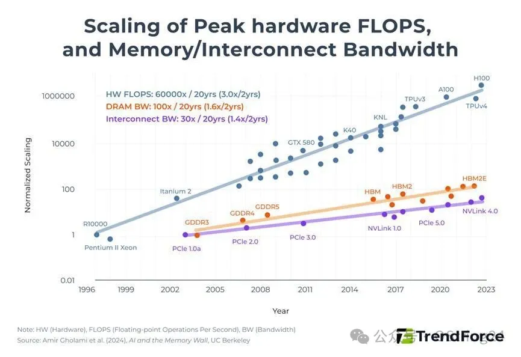

模型越来越大，kimi K3奔向了3T，静态权重就眼看要撑爆市面上GPU 显存，KV cache 还需要KDA各种linear attention 外挂做抑制，理论上存储需求是最确定的方向，但市场上最近一直在反复拉扯，似乎找不到方向。

从市场需求看，HBM 还是旗舰GPU 的首选，尽管出现了各种3D 封装（Dram 和logic Die 3D合封），喊出了14nm约等于4nm 的口号，但目前还没有看到量产的痕迹。这也是美光在年初全力all in HBM 的原因。一方面，有长协的保障，另外一方面，存储本身的技术发展，大规模量产的对技术的约束，限制了大跨步技术颠覆的可能性。

HBM 短缺，准确说是旗舰HBM 短缺，新一代HBM（HBM4）采用更先进制程和更高层数堆叠，导致良率下降，产能爬坡困难。
图片
目前传统DRAM价格已超过HBM，这是不合理的。HBM作为“高端”产品，必须大幅涨价以体现其“溢价”地位，并覆盖其更高的成本结构。

LTA 长协当前已经从3-5年演进到5年起步，但叠加滚动合同的因素，比如三桑，LTA 以5年为期限签署，但是每年可以进行一次谈判，将合同期限再做外延一年。滚动续约不仅是时间的延长，还伴随有强制性的预付款，三桑已经收到全球主要5朵云的订单，已经回收了1/4的预付款，这种现金流的稳健性，确保了未来的产能可预见性。

SK 传统Dram 和HBM 价格走势

关于库存周期，按照以往的经验，正常应该维持在4-5周，目前从公开研报数据看，三桑/Sk 的dram/nand 库存只有2-3周，远低于正常周期，更不要说存储下行周期的9-10周。另外，Dram和nand 的周期又有不同，dram侧重在晶圆进行缩微，使用更先进的工艺和封装。但nand 侧重在基于现有工艺下，从PLC向QLC/TLC 演进，在相同面积下，塞进更多存储电荷，提升容量。

关于东方力量的影响，C家目前Dram技术节点，短期内（至中期）不会对全球供需紧张格局产生实质性影响。 C主要满足国内本土需求，其技术（约1z节点）与全球领先者（三星、海力士在1a/1b向1c过渡）存在2-3代的技术差距。 要追赶先进制程，需要EUV光刻机等关键设备，国内半导体公司目前受限于采购限制，国产设备成熟尚需时日。 HBM领域差距更大，HBM不仅需要先进DRAM，还需要复杂的先进封装技术，C家与领先者的差距远大于传统DRAM。

attention 的本质是知识的压缩，也许有一天，自然世界知识能看见容量的天花板，但个体记忆，有碎片化属性，同时这些记忆不是共享的，天然独立，有点类似个人相册，容量看不到边际。

存储的方向是确定的，AI时代强化了这种确定性

写于去珲春的高铁上

