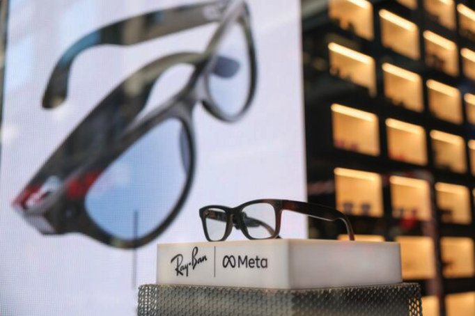
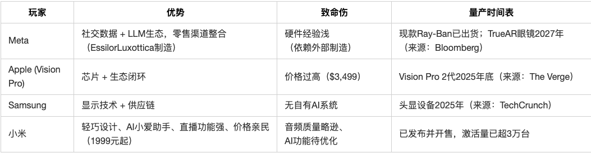

# Meta的AI 眼镜野心：35亿美元押注百年光学巨头背后的AI眼镜战争

交易本质：不是财务投资，而是战略夺权

详细的股权比例：

- Meta以35亿美元收购EssilorLuxottica 3%股权（按当日市值计算），协议包含未来增持至5%的选项。  

非控股却获董事会席位，目标直指供应链控制权——EssilorLuxottica全球6万家零售店将成Meta AI眼镜的「线下器官」。

双方自2021年合作Ray-Ban Meta智能眼镜（内置摄像头+AI助手），2025年新增Oakley运动款。EssilorLuxottica CEO Francesco Milleri去年透露：「扎克伯格想要股权，但谈判僵持」——此次闪电交易实为苹果Vision Pro上市倒逼的结果。

## 技术融合：AI算力注入光学基因的化学反应

Meta的致命短板：

- 智能手机时代受制于iOS/安卓生态，而智能眼镜是首个完全由Meta定义交互规则的硬件。  

扎克伯格内部讲话：「眼镜让我们摆脱对手机厂商的跪求」（来源：彭博社获取的Meta 2024年战略备忘录）。

EssilorLuxottica的核武器，能给到Meta 什么？

- 全球镜片专利库：16万项光学专利（包括可变焦电子镜片）
- 纳米级镀膜技术：将Micro LED投影亮度损耗降至3%（行业平均12%）
- 人体工学数据库：8000万用户头骨扫描数据，支撑舒适性设计

→ 这才是Meta真正购买的「基础设施」。

## 战场推演：巨头决战「人脸操作系统」

# 资本市场的暗战：谁被逼到墙角？

当日股价异动：
EssilorLuxottica ADR暴涨6.9%（最大单日涨幅），竞品Warby Parker跟涨4.3%——市场认定「智能眼镜渗透率将爆发」。

真正的输家：
Snapchat母公司Snap（眼镜项目Spectacles已裁员80%），财报电话会承认：「Meta+光学巨头组合无法抗衡」。

# 人类场景革命：一个惊艳案例看未来

医疗场景突破：

双方实验室正测试糖尿病视网膜病变检测眼镜：

-  通过眼底血管扫描+AI分析（精度98.2%）
-  5秒生成诊断报告（传统流程需3天）
-  成本<100（医院设备>100（医院设备>100（医院设备>5万）

→ 将颠覆约$430亿规模的眼底筛查市场

后续准备评估EssilorLuxottica二级供应商机会（如镜片镀膜材料商）

关注激光雷达厂商Lumentum（Meta眼镜核心部件商）

「当扎克伯格戴上Ray-Ban眼镜走向罗马斗兽场，他看到的不是古迹，而是数亿人眼球上即将运行的Meta操作系统。」

AI 时代，最终还是回到了入口的争夺。