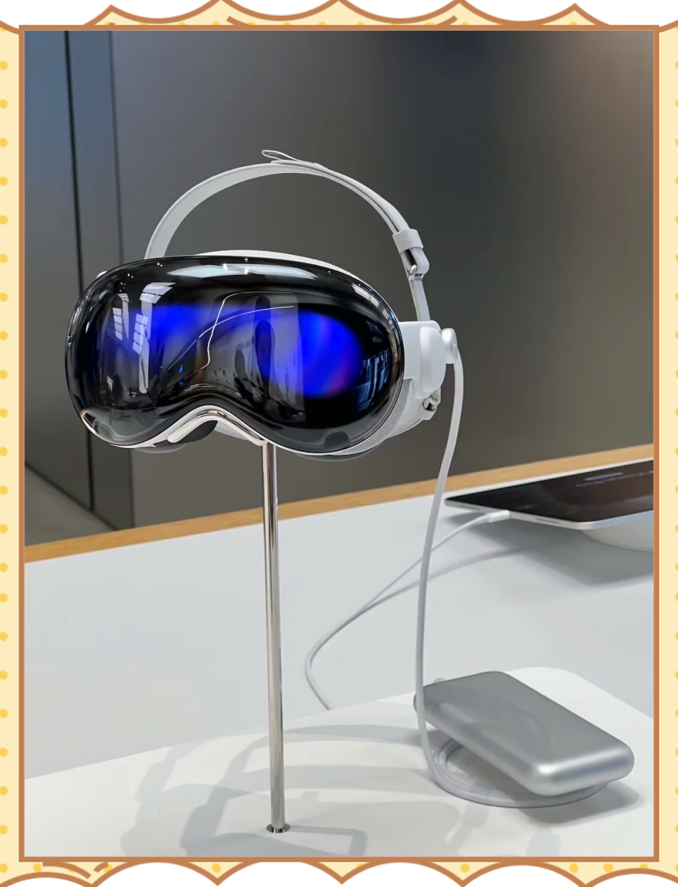

# 苹果的豪赌：第二代Vision Pro或提前杀入战场，但你真的需要升级吗？

## 核心升级：不只是换颗芯片那么简单

M4芯片的「暴力移植」

当前Vision Pro搭载的M2芯片（2022年发布）已被供应链戏称为「古董」。第二代将直接跳级采用iPad Pro同款M4处理器，神经引擎核心数可能突破16核（现款为16核）。  

关键数据：即使保持16核，M4的NPU算力仍是M2的2.3倍以上——这意味着更流畅的眼动追踪、实时环境渲染，以及库克押注的「空间AI」落地。

头带设计的「外科手术式改造」

初代1.4磅（635克）的重量被用户吐槽为「颈椎刑具」。苹果正在测试分压式头带，通过力学分散将压力点从鼻梁转移到颅顶与后脑（参考Belkin第三方方案）。
内部目标：佩戴耐受时间从2小时提升至4小时。

## 苹果的阳谋：为AR帝国铺路

AI野心的「空间化跳板」

新Vision Pro将首次搭载「空间AI引擎」，可实时解析环境物体关系（比如识别桌上咖啡杯与笔记本电脑的距离）。这并非炫技，而是为2026年AR眼镜训练场景理解能力。

Meta的狙击已就位
当苹果还在优化头带时，Meta将在2025年底推出代号Moohan的竞品：

- 重量减轻30%（约445克）
- 价格腰斩（传闻$1,800）
- 支持手势+眼动双操控

残酷现实：苹果用科技奢侈品打法，Meta走大众普及路线——你站哪边？

## 给聪明投资者的「反常识洞察」

别被「年度升级」迷惑

2027年廉价版（代号N100）才是真正杀招。现款升级更像是苹果对开发者生态的「续命针」——毕竟Vision Pro应用商店至今不足千款应用。

医疗培训、工业维修等B端场景对价格敏感度低。第二代新增的虚拟协作空间（visionOS 2.0核心功能）明显剑指微软HoloLens的腹地。

## 等还是冲？

立刻入手现款的条件：
- 你是AR应用开发者（需提前适配M4）
- 企业采购预算充足（可抵税）
- 收藏苹果初代产品的硬核信徒

建议观望的理由：
- 舒适性升级可能需第三方配件补足（现款最佳方案是$50 Belkin头带）  
- 三星Moohan、Meta AR眼镜将引发价格战
- 2027年廉价版可能砍掉冗余功能（如外屏EyeSight）

## 最后一句真心话：
「如果库克不能把重量压到一瓶矿泉水的水平（500克），Vision Pro永远只是科技人的玩具，而非下一代计算平台。」